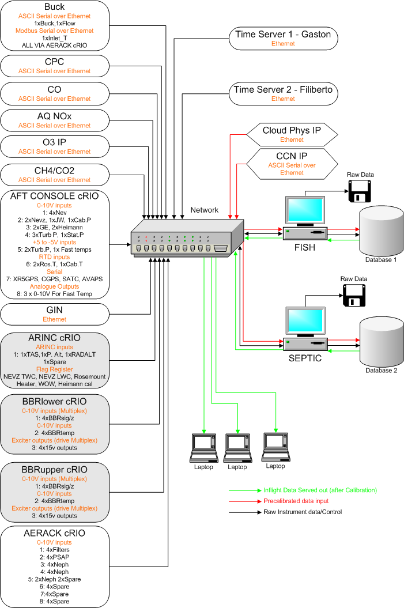
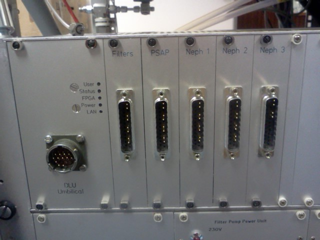
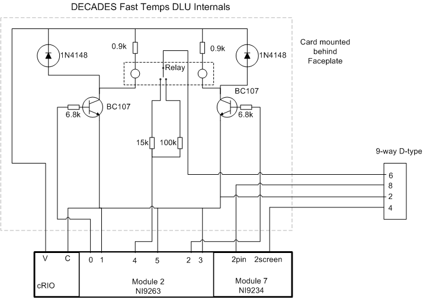
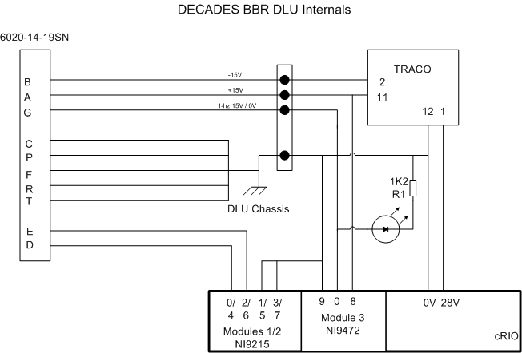

Acronyms
========

As is typical for technical documents of this type, this manual relies
on the use of acronyms throughout. This section seeks to list some of
the more commonly used acronyms to facilitate a reader’s understanding
of the system.

+----------+------------------------------------------------------------------------------------------------------------------------------------------------------------------------------------------------------------------------------------------------------------------------------------------------------------------------------------------------------------------------------------------------------------------------------------------------------------------------------+
| cRIO     | Compact RIO – a National Instruments product sold as a ‘Rugged and Reconfigurable Control and Monitoring System’ essentially used as the heart of the DLU.                                                                                                                                                                                                                                                                                                                   |
+----------+------------------------------------------------------------------------------------------------------------------------------------------------------------------------------------------------------------------------------------------------------------------------------------------------------------------------------------------------------------------------------------------------------------------------------------------------------------------------------+
| DLU      | Distributed logging unit – one of several nodes on the aircraft network designed specifically to allow introduction of analogue, serial or other inputs/outputs for the purposes of controlling instruments or acquiring data.                                                                                                                                                                                                                                               |
+----------+------------------------------------------------------------------------------------------------------------------------------------------------------------------------------------------------------------------------------------------------------------------------------------------------------------------------------------------------------------------------------------------------------------------------------------------------------------------------------+
| FPGA     | Field-Programmable Gate Array – an integrated circuit having re-programmable logic gates, in this case existing as a more fundamental and reliable method of carrying out data acquisition as part of a National Instruments cRIO                                                                                                                                                                                                                                            |
+----------+------------------------------------------------------------------------------------------------------------------------------------------------------------------------------------------------------------------------------------------------------------------------------------------------------------------------------------------------------------------------------------------------------------------------------------------------------------------------------+
| GIN      | GPS-aided Inertial Navigation unit. The Applanix POS AV 510 is located on the aft core console and supplies science-level navigation and dynamics data to DECADES                                                                                                                                                                                                                                                                                                            |
+----------+------------------------------------------------------------------------------------------------------------------------------------------------------------------------------------------------------------------------------------------------------------------------------------------------------------------------------------------------------------------------------------------------------------------------------------------------------------------------------+
| NTP      | Network Time Protocol, a networking protocol for clock synchronization between computer systems. Not as accurate as PTP.                                                                                                                                                                                                                                                                                                                                                     |
+----------+------------------------------------------------------------------------------------------------------------------------------------------------------------------------------------------------------------------------------------------------------------------------------------------------------------------------------------------------------------------------------------------------------------------------------------------------------------------------------+
| PTP      | Precision Time Protocol, a protocol used to synchronize clocks throughout a computer network. Much more accurate than NTP.                                                                                                                                                                                                                                                                                                                                                   |
+----------+------------------------------------------------------------------------------------------------------------------------------------------------------------------------------------------------------------------------------------------------------------------------------------------------------------------------------------------------------------------------------------------------------------------------------------------------------------------------------+
| RT       | RealTime. Shorthand for the real-time operating system running on the NI cRIO processors, or sometimes for the routines that are run on the Realtime OS. The RT layer carries the ability to implement real-world timing structures and carry out higher-level activities such as Network Communications that the NI FPGA-level code cannot accomplish. In DECADES applications data and timing tend to be passed between the RT and FPGA-level code on a single cRIO DLU.   |
+----------+------------------------------------------------------------------------------------------------------------------------------------------------------------------------------------------------------------------------------------------------------------------------------------------------------------------------------------------------------------------------------------------------------------------------------------------------------------------------------+
| TCP/IP   | Transmission Control Protocol (TCP) / Internet Protocol (IP). A robust network data transmission method that provides end-to-end connectivity specifying how data should be formatted, addressed, transmitted, routed and received at the destination. Typically used in this document when referring to the DLU post-processed data that are transmitted to each Tank pc for use during the post-flight data processing.                                                    |
+----------+------------------------------------------------------------------------------------------------------------------------------------------------------------------------------------------------------------------------------------------------------------------------------------------------------------------------------------------------------------------------------------------------------------------------------------------------------------------------------+
| UDP      | User Datagram Protocol. A simple network data transmission protocol, with no handshaking. Sometimes used in this document to refer to the packets of DLU data that are multicast for display purposes                                                                                                                                                                                                                                                                        |
+----------+------------------------------------------------------------------------------------------------------------------------------------------------------------------------------------------------------------------------------------------------------------------------------------------------------------------------------------------------------------------------------------------------------------------------------------------------------------------------------+
| UPS      | Uninterruptible Power Supply                                                                                                                                                                                                                                                                                                                                                                                                                                                 |
+----------+------------------------------------------------------------------------------------------------------------------------------------------------------------------------------------------------------------------------------------------------------------------------------------------------------------------------------------------------------------------------------------------------------------------------------------------------------------------------------+

Overview
========

In October 2013 the FAAM BAe146 aircraft was fitted with a new data
system, responsible for capturing and displaying core data from the
aircraft sensors. The system is generally referred to as the DECADES
system (Data Evaluation, Collection, Analysis, Display, End-use and
Storage). A schematic of the system is shown in :numref:`Fig. %s <schematic>`.

The system consists of a number of distributed data sources, all of
which collect data from sensors and relay that data across the aircraft
network to a centralised database. This database system then handles
requests from clients and serves calibrated data to clients via a web
interface, allowing data to be plotted and compared in real time, and
used to guide a science mission on the aircraft.

The DECADES system is the successor to the previous ‘HORACE’ system,
which fulfilled a similar role. The important upgrades on DECADES
include:

- Supportable off–the-shelf hardware
- Easily modified acquisition
- More flexible
- Availability of spares
- Scalable 
- Ability to continually add new display parameters.

Timing synchronisation is provided by two IEEE 1588:2008 PTP time
servers on the core console, which distribute the Precision Time
Protocol around the aircraft network, as well as the lower-specification
Network Time Protocol.

   A schematic of the layout of the new DECADES data system
   

Component Hardware List
=======================

Distributed Logging Units (DLUs)
--------------------------------

In order to acquire data from the diverse array of solely the core
sensors, it is clearly necessary to distribute data acquisition around
the aircraft. Analogue signals, occasionally very small in magnitude,
must be acquired in a precise manner, eliminating the effects of an
electrically noisy environment. To preserve modularity of the system for
future modification it also made sense to dedicate some of the
acquisition and control functions more locally. In some cases DLUs were
embedded alongside the instrumentation itself.

Common to all of the DLUs:

#. Powered in a robust manner, usually via UPS

#. Networked, and synchronised to central time standard (see :ref:`timeservers` )

#. Self-starting on power-up

#. Storage capacity to log data independently of the aircraft network

#. Display data issued via UDP multicast over the aircraft network in real time

#. Post-flight raw data sent via TCP/IP connection to each Tank pc in real time

   A typical DLU installation (AERACK)

AERACK
~~~~~~

\*\*This has now all changed owing to upgrade of the data routes for the
aerack instruments. Ask Matt\*\*\*

cRIO NI 9022 Controller and NI 9111 4-slot chassis

1 NI 9205 32-channel ±10V analogue input voltage card

**Functions:**

Control and acquisition of Nephelometer data

Acquisition of data from the Filter system and PSAP.

Acquisition and control of Buck CR2 Hygrometer.

.. table:: AERACK DLU Connector Designations – All Pins on Chassis
   :widths: auto

   +----------------------------+----------------------+-----------------------+
   | Signal                     | DLU Connector/pin    | cRIO                  |
   +----------------------------+----------------------+-----------------------+
   | |                          | Filters (high:low)   | Module 1 (high:low)   |
   +----------------------------+----------------------+-----------------------+
   | Filter 1 flow              | 1:2                  | 0:1                   |
   +----------------------------+----------------------+-----------------------+
   | Filter 1 Pressure          | 4:5                  | 2:3                   |
   +----------------------------+----------------------+-----------------------+
   | Filter 2 Flow              | 7:8                  | 4:5                   |
   +----------------------------+----------------------+-----------------------+
   | Filter 2 pressure          | 10:11                | 6:7                   |
   +----------------------------+----------------------+-----------------------+
   | |                          | PSAP                 | Module 2(high:low)    |
   +----------------------------+----------------------+-----------------------+
   | PSAP Lin                   | 1:2                  | 0:1                   |
   +----------------------------+----------------------+-----------------------+
   | PSAP Log                   | 4:5                  | 2:3                   |
   +----------------------------+----------------------+-----------------------+
   | PSAP Transmittance         | 7:8                  | 4:5                   |
   +----------------------------+----------------------+-----------------------+
   | PSAP Flow                  | 10:11                | 6:7                   |
   +----------------------------+----------------------+-----------------------+
   | |                          | Neph 1               | Module 3(high:low)    |
   +----------------------------+----------------------+-----------------------+
   | Neph Pressure              | 1:2                  | 0:1                   |
   +----------------------------+----------------------+-----------------------+
   | Neph Temperature           | 4:5                  | 2:3                   |
   +----------------------------+----------------------+-----------------------+
   | Neph Blue Total Scatter    | 7:8                  | 4:5                   |
   +----------------------------+----------------------+-----------------------+
   | Neph Green Total Scatter   | 10:11                | 6:7                   |
   +----------------------------+----------------------+-----------------------+
   | |                          | Neph 2               | Module 4(high:low)    |
   +----------------------------+----------------------+-----------------------+
   | Neph Red Total Scatter     | 1:2                  | 0:1                   |
   +----------------------------+----------------------+-----------------------+
   | Neph Blue Backscatter      | 4:5                  | 2:3                   |
   +----------------------------+----------------------+-----------------------+
   | Neph Red Backscatter       | 7:8                  | 4:5                   |
   +----------------------------+----------------------+-----------------------+
   | Neph Green Backscatter     | 10:11                | 6:7                   |
   +----------------------------+----------------------+-----------------------+
   | |                          | Neph 3               | Module 5(high:low)    |
   +----------------------------+----------------------+-----------------------+
   | Neph Humidity              | 1:2                  | 0:1                   |
   +----------------------------+----------------------+-----------------------+
   | Neph Status                | 4:5                  | 2:3                   |
   +----------------------------+----------------------+-----------------------+

CORCON
~~~~~~

cRIO NI 9022 Controller and NI 9112 8-slot chassis

2 NI 9215 4-channel ±10V voltage cards

1 NI 9205 32-channel ±10V analogue input voltage card

1 NI 9217 4-channel RTD card

1 NI 9870 4-port RS232 Serial card \*currently unused\*

1 NI 9263 4-channel analogue output card ±10V

2 NI 9234 4-channel sigma delta ADC ±5V

**Functions:**

1. Records data from: Deiced and Non-Deiced temperature sensors; General
Eastern Hygrometer; Nevzorov Liquid/Ice Water sensor; Cabin, S9 and
Turbulence probe pressure sensors; Heimann Radiometer and calibration
unit

2. Produces signal flags for Weight on Wheels, Heimann Radiometer
Calibration and Deiced Temperature heater state, passing these to the
Port Aft DLU for logging (done this way to keep equivalent to previous
system).

3. Transmits calibrated data feed via serial connection to AVAPS

.. table:: Core Console Hardware Connections
   :widths: auto

   +---------------------------+--------------------------------+---------------------------+
   | Signal                    | DLU Connector/pin (high:low)   | cRIO                      |
   +---------------------------+--------------------------------+---------------------------+
   | |                         | |                              | **Module 3 (high:low)**   |
   +---------------------------+--------------------------------+---------------------------+
   | **Heimann**               | PINS                           | NI9215                    |
   +---------------------------+--------------------------------+---------------------------+
   | Measured Temperature      | 7:8                            | 0:1                       |
   +---------------------------+--------------------------------+---------------------------+
   | Calibration Temperature   | 10:11                          | 2:3                       |
   +---------------------------+--------------------------------+---------------------------+
   | **General Eastern**       | PINS                           | |                         |
   +---------------------------+--------------------------------+---------------------------+
   | Dewpoint                  | 1:2                            | 4:5                       |
   +---------------------------+--------------------------------+---------------------------+
   | Control Signal            | 4:5                            | 6:7                       |
   +---------------------------+--------------------------------+---------------------------+
   | |                         | |                              | **Module 4 (high:low)**   |
   +---------------------------+--------------------------------+---------------------------+
   | **Nevzorov**              | Analogue 1 – Conn 1 PINS       | NI9205                    |
   +---------------------------+--------------------------------+---------------------------+
   | TWC Reference I (-ve)     | 1                              | 20 *(AI8)*                |
   +---------------------------+--------------------------------+---------------------------+
   | TWC Reference I (+ve)     | 5                              | 1 *(AI0)*                 |
   +---------------------------+--------------------------------+---------------------------+
   | TWC Reference V (-ve)     | 2                              | 21 *(AI9)*                |
   +---------------------------+--------------------------------+---------------------------+
   | TWC Reference V (+ve)     | 6                              | 2 *(AI1)*                 |
   +---------------------------+--------------------------------+---------------------------+
   | TWC Collector I (-ve)     | 3                              | 22 *(AI10)*               |
   +---------------------------+--------------------------------+---------------------------+
   | TWC Collector I (+ve)     | 7                              | 3 *(AI2)*                 |
   +---------------------------+--------------------------------+---------------------------+
   | TWC Collector V (-ve)     | 4                              | 23 *(AI11)*               |
   +---------------------------+--------------------------------+---------------------------+
   | TWC Collector V (+ve)     | 8                              | 4 *(AI3)*                 |
   +---------------------------+--------------------------------+---------------------------+
   | |                         | Analogue 1 – Conn 2 PINS       | NI9205                    |
   +---------------------------+--------------------------------+---------------------------+
   | LWC Reference I (-ve)     | 1                              | 24 *(AI12)*               |
   +---------------------------+--------------------------------+---------------------------+
   | LWC Reference I (+ve)     | 5                              | 5 *(AI4)*                 |
   +---------------------------+--------------------------------+---------------------------+
   | LWC Reference V (-ve)     | 2                              | 25 *(AI13)*               |
   +---------------------------+--------------------------------+---------------------------+
   | LWC Reference V (+ve)     | 6                              | 6 *(AI5)*                 |
   +---------------------------+--------------------------------+---------------------------+
   | LWC Collector I (-ve)     | 3                              | 26 *(AI14)*               |
   +---------------------------+--------------------------------+---------------------------+
   | LWC Collector I (+ve)     | 7                              | 7 *(AI6)*                 |
   +---------------------------+--------------------------------+---------------------------+
   | LWC Collector V (-ve)     | 4                              | 27 *(AI15)*               |
   +---------------------------+--------------------------------+---------------------------+
   | LWC Collector V (+ve)     | 8                              | 8 *(AI7)*                 |
   +---------------------------+--------------------------------+---------------------------+
   | |                         | |                              | **Module 5 (high:low)**   |
   +---------------------------+--------------------------------+---------------------------+
   | **Pressures**             | Analogue 1 – 3 SKTS            | |                         |
   +---------------------------+--------------------------------+---------------------------+
   | Cabin Pressure            | 1:6                            | 4:5                       |
   +---------------------------+--------------------------------+---------------------------+
   | |                         | 6020-16-26PN Turbulence        | |                         |
   +---------------------------+--------------------------------+---------------------------+
   | S9Static Pressure         | E:F                            | 6:7                       |
   +---------------------------+--------------------------------+---------------------------+
   | |                         | |                              | **Module 6 (high:low)**   |
   +---------------------------+--------------------------------+---------------------------+
   | Johnson Williams          | 1:2 PINS                       | 0:1                       |
   +---------------------------+--------------------------------+---------------------------+
   | |                         | |                              | |                         |
   +---------------------------+--------------------------------+---------------------------+
   | **Turbulence**            | 6020-16-26PN Turbulence        | |                         |
   +---------------------------+--------------------------------+---------------------------+
   | TP1 P0-S10                | G:H                            | 2:3                       |
   +---------------------------+--------------------------------+---------------------------+
   | TP4                       | N:P                            | 4:5                       |
   +---------------------------+--------------------------------+---------------------------+
   | TP5                       | R:S                            | 6:7                       |
   +---------------------------+--------------------------------+---------------------------+
   | |                         | |                              | **Module 7 (high:low)**   |
   +---------------------------+--------------------------------+---------------------------+
   | |                         | |                              | NI 9234                   |
   +---------------------------+--------------------------------+---------------------------+
   | TP2                       | J:K                            | 0pin:0screen              |
   +---------------------------+--------------------------------+---------------------------+
   | TP3                       | L:M                            | 1pin:1screen              |
   +---------------------------+--------------------------------+---------------------------+
   | **Fast Temps**            | See Figure 2 SKTS              | |                         |
   +---------------------------+--------------------------------+---------------------------+
   | Signal                    | 8:4                            | 2pin:2screen              |
   +---------------------------+--------------------------------+---------------------------+
   | |                         | |                              | **Module 2 (high:low)**   |
   +---------------------------+--------------------------------+---------------------------+
   | Excitation voltage        | See Figure 2                   | |                         |
   +---------------------------+--------------------------------+---------------------------+
   | **Temps**                 | Non Deiced SKTS                | **Module 1 (high:low)**   |
   +---------------------------+--------------------------------+---------------------------+
   | Excitation current        | 6:2                            | 0:3                       |
   +---------------------------+--------------------------------+---------------------------+
   | Signals                   | 8:4                            | 1:2                       |
   +---------------------------+--------------------------------+---------------------------+
   | |                         | Deiced SKTS                    | |                         |
   +---------------------------+--------------------------------+---------------------------+
   | Excitation current        | 6:2                            | 4:7                       |
   +---------------------------+--------------------------------+---------------------------+
   | Signals                   | 8:4                            | 5:6                       |
   +---------------------------+--------------------------------+---------------------------+
   
**Additional front-panel cards:**

Fast Temperature

To translate the thermistor measurement to a voltage, the thermistor is
operated in a potential divider with one of two selectable precision
resistors (depending on the temperature range) A 5V switched source from
the NI 9263 determines which series resistor is used, the sourcing
current of the module is too low to complete the switching unaided so a
simple transistor amplifier is used to boost this. The NI9263 also
supplies the voltage for the potential divider.

\*\*Update to reflect Matt’s changes of this hardware card\*\*

   A diagram of the DLU Fast Temperature circuit.

Signal Register

This card translates the various signal outputs from the 5 data sources
(Nevz TWC, Nevz LWC, Rosemount Deiced Heater, WOW, Heimann Calibration)
into binary outputs for the digital input cards. This is done using
miniature relays.

Temperature Card

\*\*update with the info for Matt’s card\*\*

LOWER and UPPER BBR (Two DLUS)
~~~~~~~~~~~~~~~~~~~~~~~~~~~~~~

cRIO NI 9022 Controller and NI 9111 4-slot chassis

2 NI 9215 4-channel ±10V analogue input voltage cards

1 NI 9472 8-channel 24V Digital Output card

Additional Front Panel Cards:

28-15V DC-DC converter and connectors

**Function:**

Acquire data from the Broadband Radiometer (BBR) instruments.

Each BBR requires a switched 15V signal to determine whether a signal or
reference (‘zero’) measurement is being output. These are switched
halfway through every second. The DC-DC converter to provide the ±15V
BBR supply is mounted on the inside of the BBR DLU front panel. 15V for
the switched circuit comes from a small voltage regulator card mounted
on the rear of the same panel, this is switched using the NI 9472 module

   DECADES BBR schematic – \*\*Matt has a new version of this 

.. table:: BBR DLU Connector Designations – All Pins on Chassis
   :widths: auto

   +---------------------+---------------------+---------------------------+
   | Signal              | DLU Connector/pin   | cRIO                      |
   +---------------------+---------------------+---------------------------+
   | |                   | (high:low)          | **Module 1 (high:low)**   |
   +---------------------+---------------------+---------------------------+
   | **Radiometers 1**   | ALL SKTS            | NI9215                    |
   +---------------------+---------------------+---------------------------+
   | Radiation           | D:F                 | 0:1                       |
   +---------------------+---------------------+---------------------------+
   | Temperature         | E:F                 | 2:3                       |
   +---------------------+---------------------+---------------------------+
   | **Radiometers 2**   | |                   | |                         |
   +---------------------+---------------------+---------------------------+
   | Radiation           | D:F                 | 4:5                       |
   +---------------------+---------------------+---------------------------+
   | Temperature         | E:F                 | 6:7                       |
   +---------------------+---------------------+---------------------------+
   | **Radiometers 3**   | |                   | **Module 2 (high:low)**   |
   +---------------------+---------------------+---------------------------+
   | Radiation           | D:F                 | 0:1                       |
   +---------------------+---------------------+---------------------------+
   | Temperature         | E:F                 | 2:3                       |
   +---------------------+---------------------+---------------------------+
   | **Radiometers 4**   | |                   | |                         |
   +---------------------+---------------------+---------------------------+
   | Radiation           | D:F                 | 4:5                       |
   +---------------------+---------------------+---------------------------+
   | Temperature         | E:F                 | 6:7                       |
   +---------------------+---------------------+---------------------------+
   | |                   | |                   | |                         |
   +---------------------+---------------------+---------------------------+
   
NB Module 3 NI9472 Digital I/O exists purely to generate the required
1-hz signal needed by the BBR to switch between sending zero/radiation
signal on pin D of the 6020-14-19 connector. The correct function of the
cRIO and the TRACO dc-dc converter providing the ±15v supply is
confirmed by the LED indicator on the front panel.

PRTAFT DLU
~~~~~~~~~~

1 NI 9403 32-channel TTL digital input card.

1 SET ARINC 429 Tx/Rx card

1 NI 9215 4-channel ±10V analogue input voltage card

Functions
#########

1. Records status flags from Weight-on-wheels signal , Heimann Radiometer calibration state and deiced heater state
2. Acquires data from the CORCON JCI-140 field mill (static sensor)
3. Acquires ARINC429 data from the relay from the aircraft air data computer, comprising Radar Altitude, Indicated Airspeed and Pressure Altitude.
4. Receives UDP data from the GPS/INU system, which are reformatted for transmission to the aircraft display system via the Tank computers.  Though imperfect, this configuration allowed GIN data to be simply ingested alongside other DLU data.

GIN Pseudo-DLU
~~~~~~~~~~~~~~

Though not strictly a DLU in many senses, the Applanix POS AV 510
GPS-aided Inertial Navigation Unit carries out many functions of a DLU
and the navigation/position/dynamics data that it measures is critical
to the operation of many of the display functions. GIN is located on the
Aft Core Console. In common with the other DLUs, GIN stores data
internally, which can be accessed later via FTP in the case of network
or other communications issues preventing data reaching either Tank pc.

The GPS/Inertial Navigation Unit outputs data across three ip ports. The
Display data port (5600) outputs UDP data at 1-hz. The Primary and
Secondary data ports (5602 and 5603 respectively) output TCP/IP data at
up to 200hz, user selectable, currently 50hz. Each one of these is
dedicated to a Tank PC for post-flight data. The secondary data port is
buffered in case of network communication problems. UDP data are used
for in-flight display as they are within 1s of real-time, whereas the
other data ports are subject to delay. For further information see the
relevant GIN documentation.

Currently the GIN UDP messages are picked up by the PRTAFT DLU and are
re-formatted and relayed alongside its other data, to keep GIN data
compatible with that from the other Core DLUs.

Core Chemistry Pseudo-DLU
~~~~~~~~~~~~~~~~~~~~~~~~~

At the time of writing, this pseudo-DLU was in fact an industrial pc,
configured to acquire data from the serial outputs of the Chemistry CO
and Ozone instruments and relay these data, in common with the methods
employed on the conventional DLUs, via UDP multicast and TCP/IP
connection to the Tank PCs. In addition to this the Chemistry pc carries
out other control and data functions, fully documented elsewhere.

2.1.7 Other Pseudo-DLUs (The Way Ahead!)
~~~~~~~~~~~~~~~~~~~~~~~~~~~~~~~~~~~~~~~~

The philosophy behind aircraft data acquisition for the lifetime of the
new data system will be the simplicity with which new data sources can
be added. It is intended that data be acquired by a suitable local
method, whether on PC, cRIO, Arduino or a full-blown purpose-built DLU
(all of these methods have been demonstrated on the aircraft system to
date), and transmitted across the network in the same way as the
existing DLUs. As long as the six basic common factors listed in Section
2.1 can be satisfied then in theory any data logged by these means can
be simply stored, post-processed and displayed in flight.

CCN and CPC
~~~~~~~~~~~

Data will be exported in an analogous fashion to the cRIO data by the
CCN rack pc.

Cloud Physics
~~~~~~~~~~~~~

Datastream not yet in existence.

.. _timeservers:

Timeservers (Filiberto and Gaston)
----------------------------------

Two Meinberg M600 PTP (Precision Time Protocol) Grandmaster Clocks,
named as above, are fitted as part of the Core Console rack. The units
were retrofitted with a modified GPS module (MGR170SV) to allow GPS
signal acquisition whilst moving. Even without GPS lock, each unit is
capable of time accuracies of better than 22µs within a 24-hour period.
With GPS the instantaneous time specification is better than 50ns.
Outputted time is in standard UNIX (POSIX) format representing time
since midnight on January 1\ :sup:`st` 1970.

Filiberto and Gaston are both Stratum 1 Grandmaster clocks outputting
their PTP messages over the aircraft LAN. Filiberto is configured to
have a higher priority than Gaston, in order that all PTP-enabled
devices on the network will synchronise to the same time. In the event
of a failure of Filiberto then all systems revert to Gaston. Were Gaston
to also fail then the remaining PTP-capable clock sources on the
aircraft, including all of the cRIO DLUs, would essentially elect a new
leader and all synchronise to that.

In addition each timeserver serves out time synchronisation data via the
Network Time Protocol (NTP). Standard NTP software such as ‘abouttime’
or that embedded in Windows 7 can use either Gaston of Filiberto ip
addresses as ntp time servers.

Both systems require a GPS feed, provided by separate standard aircraft
L1/L2 antennae mounted on the aircraft fuselage. One uses an Aeroantenna
AT1675-17W-TNCF-000-RG-36-NM that was fitted for a former instrument,
the other employs a micropulse 12700 26dB L1 only antenna that was
formerly used for the old aircraft master time generator that these
systems replaced.

Tank Computers (Fish and Septic)
--------------------------------

Two fanless industrial-grade pcs comprise the central recording,
database and display servers, as follows:

Processor
   Socket P Intel® Core™ Duo 2.4GHz, 3MB L2 Cache, Processor P8600

Memory
   Built-in one 2GB SO-DIMM memory

Hard-disk
   One 2.5" SATA Solid-State Disk capacity 120Gb

Power Input
   12V DC in with 4pin mini-DIN, 45W max

Operating Temperature
   -20°C - 70°C (SATA SSD) with air flow

Operating Shock
   Half-Sine Shock Test 5G/11ms, 3 shocks per axis

Operating Vibration
   MIL-STD-810F 514.5 C-1

Weight (Net/Gross)
   3.5Kg/4.2Kg

Dimension(WxHxD)
   310 x 200 x 55mm

Dual LAN ports
   (only one is currently used)

Both PCs are housed on a tray on the Forward Core Console, with the
power supply coming from dedicated industrial 19-inch rack supplies on
the same rack, in turn powered from the rack UPS, detailed below. These
power-supplies are also connected in a way such that if either were to
fail, the remaining supply has spare capacity to provide power for both
Tank computers at once.

Also see :ref:`tanks-proposal`.

UPS
---

Two Eaton 750i (500w) UPS are housed in the Forward Core Console.
Unfortunately these could not be configured to be autonomously
redundant, so instead are rotated in service with one unit being
connected for a few months at a time. The UPS units are capable of
supporting the aircraft Network and Data system, including the Flight
Manager Display, Tank pcs, DLUs, main and sidewall switches, and GIN,
for up to 15 minutes in the case of severe power outage.

Aircraft Network
----------------

Fully documented elsewhere, the (currently 1Gb/s) aircraft network
provides the communication backbone to allow data to flow around the
DECADES system. It comprises a main switch on the forward core console
and sidewall and subsidiary switches elsewhere around the aircraft. All
data acquired by the DLUs is sent to the TANK PCs over the network, and
the display of data to client applications is clearly dependent on this
infrastructure.

DLU Software
============

DLU Labview Code Functions
--------------------------

Common Factors
~~~~~~~~~~~~~~

Four out of five cRIO DLUs (CORCON, UPPBBR, LOWBBR, PRTAFT) host
Field-Programmable Gate Array (FPGA) code triggered by code running on
the realtime (RT) engine. The RT side typically consists of a number of
loops, dealing with functions such as:

- Data acquisition triggering and timing
- Flight Number detection
- File I/O and administration
- UDP data multicast
- TCP/IP data communication with dedicated pcs
- Data packet assembly
- Error handling

All cRIO code is set to run immediately on startup. The FPGA bitfiles
have been compiled and loaded to each cRIO to start the FPGA side and
each RT module has also been compiled as a startup application and
loaded to each cRIO. This means that when power is supplied to the DLUs
from the forward core console UPS, all of the cRIOs will start to log
and transmit data automatically following boot.

The FPGA code actually carries out the low-level sampling of the inputs.
It is in all cases directly driven by the RT code for timing and
synchronisation purposes, using the standard Labview ‘interrupts’
technique. Interrupts take a finite time (up to 250µs) to administer, so
for future high-rate data acquisition out of the scope of this project,
it may become necessary to change this technique.

Where appropriate, FPGA data acquisition has been optimised such that
the maximum possible successive samples are taken, compatible with
equi-spaced sampling of high-rate parameters within a second. Owing to
processing time it isn’t possible to capture the total population of
data that is available. For example, each 32Hz turbulence probe data
point is acquired by making 100 samples each separated by 310µs.
Sampling for one point thus takes 31000µs, leaving a 250µs allowance for
the interrupt administration time, shared variable transfer and loop
processing time of each of the 32 samples per second.

Each cRIO FPGA routine contains a 1Hz loop which as part of its code
operates the FPGA LED on the front panel of the cRIO, which is in turn
relayed to the front of each DLU. These LEDs flash in time with the
front panel USER LED operated by the RT code, and when synchronised
demonstrate that the FPGA and RT code are operating correctly in tandem.

Data are passed between the FPGA and RT using shared variables. It
should be noted that for ease these have been implemented based on the
Labview Scan Engine which among other things means that if data start to
be passed back and forth at high frequencies (approaching 1kHz) then
this may need to be redesigned. The current maximum data rate of 32Hz is
well below this limit.

The RT side of each cRIO handles synchronisation and communication with
the other elements of the data acquisition system. Routines on the
Flight Manager pc allow assignment of a flight number via the RT code,
and also permit routine checks to be carried out on the data (see later
section). RT timing is linked to the absolute clock available on each
cRIO, linked directly through the IEEE 1588 Precision Time Protocol
software run by the cRIOs. This uses the networked Meinberg Timeserver
to link each datastream back to UTC time to a sub-microsecond accuracy.

RT code assembles data packets from each cRIO with originating
identifiers, these are documented in the data section. Every cRIO saves
these packets in its internal memory (enough space for well in excess of
20 flights of even high-rate GIN data on each), and transmits a copy to
each of the database machines (currently Fish and Septic) for storage.
UDP packets are sent to a multicast address enabling assimilation into
the Flight Database for display purposes.

Standard RT Loops
~~~~~~~~~~~~~~~~~

The 5 cRIO DLUs largely consist of common elements, differing only in
the data handled, parsed and packetised. The following elements are
common across all 5 RT applications:

Data Acquisition
################

This routine triggers the FPGA acquisition, and reads the shared
variables that contain the data acquired by the FPGA. Data from the
shared variables are successively bound together in sensible chunks
using the Labview Queue method, to be dealt with by the Packet Assembly
loop.

Data Packet Assembly
####################

This loop flushes the acquired data from the queue system, unbundles the
data and sets up two data packets –binary for the TCP/IP transmission
and ASCII for the UDP multicast. In doing so it changes the bundle
method for the high-rate binary data so that multiple values from the
same parameter appear together, only uses the last point of each second
for the UDP ascii packet, and affixes a UNIX time stamp from the
previous second to the data. This means that all data are tagged as
belonging to the second during which they were acquired.

Error Handler
#############

A prototype error handler has been inserted. At this stage we don’t know
which errors are going to come up, so this is just a placeholder that
writes errors to a file.

Status and Troubleshooting
~~~~~~~~~~~~~~~~~~~~~~~~~~

In order for a user to successfully troubleshoot the hardware without
resorting to a networked software tool, the cRIOs at the heart of each
DLU have had their FPGA and USER front-panel LEDs employed as indicators
of functionality of the hardware and software. These LEDs have been
brought out onto the front panels of each DLU by the use of internal
light guides, and act as a kind of ‘heartbeat’ indicator.

The USER LED flashes once per second, triggered from within one of the
data acquisition loops actually inside the RT. The usual pattern of
regular flashes should be observed: On for a second, Off for a second.

The FPGA LED flashes once for each iteration of a second’s worth of FPGA
code. The FPGA code is triggered by the RT code, so there should be no
instance of the FPGA flashing without the USER LED, its state should
change at the same time as the RT USER LED. Correct FPGA and RT function
will be seen when the LED states change once a second, at the same time.
A foible of the system sometimes leads to the FPGA and RT LED states
being opposed – ie one is on but the other is off. This still indicates
a working system.

In addition, the RT LED colour depends on the state of its TCP/IP
connection with a tank. If it has a connection by this means, to send
data for post-flight processing, the LED will flash green. If not it
will flash yellow.

Code errors have been observed that cause the FPGA or RT code to halt.
This is usually fixed by restarting. Very irregular triggering of the RT
LED (and therefore RT code in general) has been seen when an unexpected
PTP Grandmaster Clock source was present on the network, and was causing
the DLU internal clock to change its time unreliably.

Detailed Code Description
-------------------------

UPP/LOW BBR FPGA
~~~~~~~~~~~~~~~~

Each of the upper and lower BBR DLUs provides support for 3 outputs from
4 BBRs. Two of these outputs are multiplexed over the same cabling, and
so the DLU must also tell the BBR how to control this.

When the main FPGA loop is initiated, once per second, the cRIO reads 8
inputs, consisting of 4 signals and 4 temperature readings, one for each
supported radiometer. After just under half a second ie 1000 samples
(set in Count(usec) on front panel), the FPGA stops acquiring data and
waits for a change in the signal/zero shared variable before continuing.
After this is received, the four signals are read again. The
temperatures are not read a second time.

In parallel with this loop, a second loop cycles the output from a
digital output card in the cRIO DLU. This changes exactly every
half-second, triggering the signal/zero change that is measured above.

The outcome of these loops is that 4 signal readings, 4 temperature
readings and 4 zero readings are acquired once per second, each based on
an average of 1000 successive readings. These are passed to the RT side
via shared variables and the loop is re-initiated by the RT code
acknowledging the interrupt.

UPP/LOW BBR RT
~~~~~~~~~~~~~~

Data acquisition loop reads in the 12 parameters output by the FPGA.
Packet assembly involves a simple unbundling of 3 queues and adding the
resulting data together for the 12 measurements.

AERACK FPGA \*\*CHANGED\*\*
~~~~~~~~~~~~~~~~~~~~~~~~~~~

This is a straightforward loop acquisition loop with an interrupt for RT
synchronisation. It contains 5 sub-loops, one for each module, which
deal with the outputs from each of the five modules in the cRIO. The
measurements, in common with the other cRIOs, are made using a number of
samples (20) with a wait time in each (49995)

Serial data from the Buck CR2 instrument are re-broadcast across the
aircraft LAN using a Netcomm device. The AERACK cRIO acquires the data
over the LAN, stores and exports them alongside its analogue inputs.

AERACK RT \*\*CHANGED\*\*
~~~~~~~~~~~~~~~~~~~~~~~~~

The main AERACK data acquisition loop is relatively standard. Outputs
from the 5 cards are grouped and queued together (Mod 1-5), and the
order is preserved into the ASCII and UDP data packets.

Additionally, the AERACK DLU handles serial-over-ethernet communication
with the Buck CR2 Hygrometer. This involves a secondary acquisition loop
which maintains a TCP/IP connection with the Buck system, and reads data
from that instrument a line at a time. 11 parameters are extracted from
the data and after a validity check these are placed in their own queue.
It should be noted that the Buck data only appear 14 seconds out of
every 15, for reasons best known to the manufacturer. Never mind, it’s a
slow-response instrument anyway.

CORCON FPGA \*CHANGED\*
~~~~~~~~~~~~~~~~~~~~~~~

This consists of 5 acquisition loops governing the different data rates
at which parameters are measured. 1, 4, 16 and 32hz.

In general the sampling consists of loops which execute a number of
times, with a wait time between each execution. For example the 8Hz loop
executes 20 samples with 6240µs wait in between each one (covering
124800µs in total). This is executed 8 times a second (998400µs) leaving
a total of 1600µs for the administration of the 8 interrupts required
and the running of the code itself.

The resulting samples are copied to shared variables and the loops are
paused awaiting interrupts to be acknowledged by the RT code before
running the next iteration.

The 1hz loop also contains some code handling the new fast-temperature
sensor circuit. Its function is to automatically decide on the most
appropriate resistor to run in the potential divider circuit with the
fast thermistor, this changes with temperature. The code is not
complete. Two further loops control the relay action required to effect
the resistance change.

CORCON RT
~~~~~~~~~

The multiple acquisition rate nature of the CORCON DLU necessitates
multiple acquisition loops to put each shared variable measurement into
its appropriate queue. Like parameters with the same measurement module
or same sample frequency tend to be grouped together. In some cases
parameters are queued alongside null (zero) values to reduce the number
of different subVIs that would otherwise be needed to combine the data
into sensible chunks. These nulls are carried through into the ASCII and
Binary data packets. This isn’t ideal, but does leave room for future
addition of new parameters.

Matt to add description of serial data to AVAPS (format, any special
stuff)

PRTAFT FPGA
~~~~~~~~~~~

This consists of the standard loop/interrupt structure, but in this case
reads inputs from three sources. The first of these is a binary flag
register that takes inputs from the following:

- Rosemount DI Temperature (heater off/on)
- Heimann (no cal/cal)
- Weight on Wheels (on ground/in air)

These are sampled once per second and sent to binary shared variables to
be picked up by the RT code.

The other two loops involve the SET ARINC module which allows the cRIO
to communicate with the aircraft ARINC 429 protocol, by which means we
gain access to the Indicated Airspeed and Pressure Altitude data (~20hz)
and Radio Altimeter data (2hz). Both of these loops work in the same
way:

The SET module receives data across a number of ARINC labels. IAS is
label 206, PALT is 203 and RADALT is 164, all in Octal. The ARINC label
is transmitted in reverse as the first 8 bits of each message, and for
some reason (wiring backwards?) we need to also invert each of these 8
bits to get valid label numbers. Once the loop finds a valid label it
strips out the data portion of the message and the sign bit, and exports
them to shared variables. Having found valid messages the loops all
interrupt and wait for the RT side to trigger the next iteration.

\*\*Matt to add JCI140 static data stuff

PRTAFT RT
~~~~~~~~~

There are three data acquisition loops to match the three different
sampling frequencies employed on the PRTAFT DLU. ARINC429 data for the
PALT and IAS are output along with 14 or so other quantities at 13kbps.
Each message is 32 bits, so we expect somewhere around 25 IAS and PALT
measurements every second. Historically FAAM have only used the first 20
measurements of each second and assumed these to actually be equi-spaced
across the second, this is what we continue to do for ease.

Some of the ARINC data are broadcast in an idiosyncratic format
according to the aviation ‘standards’ that define the avionics
equipment, the Data Acquisition routine applies some constants in an
appropriate way. The ARINC data are in an integer format and this is
preserved for retransmission into the queues as follows:

Mod 1: 20Hz

- PALT/10000 is the pressure altitude in metres
- IAS/32 is the indicated airspeed in Knots

Mod 3: 2Hz

- RADALT is the height above the surface in metres.

These values are directly exported to the ascii and binary packets.

Additionally the binary flag register (Mod 2) is converted to 0/1 value
unsigned integers for the ASCII/Binary packets

Tank functions, Database and Data Storage
=========================================

Display System
==============

Interfacing with the data system – Display/Storage
==================================================

Backups and Spares
==================

DECADES spares kit
------------------

Spares for every National Instruments module, processor and backplane
used within any of the Core DLUs

- Spare connectors
- Laboratory power supplies for a single DLU and a single Tank pc.
- Spare boards for some of the front-panel DLU cards.
- A portable hard drive is kept in the DECADES spares kit which contains the following backups:

  + Images of each Tank pc
  + Images of both realtime and FPGA code for each cRIO DLU.
  + cRIO imaging software
  + Instructions for backup and restore.

These backups are refreshed periodically

Additionally, a spare Power One A/C to D/C converter is held within the
core packup, and is a like-for-like spare for the unit that supplies dc
power for the core DLUs, located on the Aft Core Console.

Standard formats
================

TCP/IP Format example

UDP format example

Appendices
==========

Appendix XX. Meinberg Time Server
---------------------------------

Appendix XX. Tank PC Specification/Manual
-----------------------------------------

Appendix XX. Database stuff???
------------------------------
